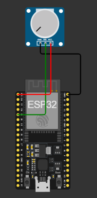
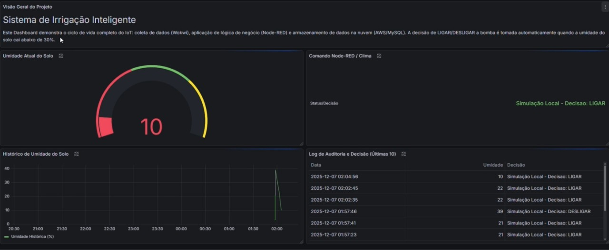

# 💧 Projeto — Sistema de Irrigação Inteligente com IoT

A agricultura é um dos setores que mais consomem água no Brasil, exigindo métodos de manejo hídrico mais eficientes para garantir a sustentabilidade. A irrigação manual, ineficaz e passível de desperdício, está sendo rapidamente substituída pela Agricultura de Precisão habilitada pela Internet das Coisas (IoT).
Este repositório documenta toda a arquitetura de um Sistema de Irrigação Inteligente que utiliza o poder da IoT (via Wokwi/ESP32, AWS, Node-RED, MySQL e Grafana) para otimizar o consumo de água, condicionando a irrigação à umidade real do solo e à ausência de chuvas iminentes (previsão do tempo).
O objetivo é que qualquer pessoa consiga reproduzir o projeto do zero, entendendo cada etapa e validando toda a solução de forma escalável e de baixo custo, contribuindo diretamente para os Objetivos de Desenvolvimento Sustentável (ODS) da ONU, como o ODS 6 (Água Potável e Saneamento).

# 1. Configuração do Ambiente Geral 🛠️

O projeto funciona com três pilares principais:

* *A. Borda (Wokwi/ESP32)* → Sensores e atuadores
* *B. Núcleo/AWS (EC2 + Mosquitto + Node-RED + MySQL)*
* *C. Visualização (Grafana)*

A seguir, cada um deles é explicado separadamente.

---

##💻 A. Borda — Simulação no Wokwi

A borda simula o dispositivo físico (ESP32), contendo:

* *Sensor de umidade* → representado por um potenciômetro
* *Atuador* → LED simulando a bomba d'água

### 🔧 O que você precisa configurar

1. Nos *dois códigos* (sensor e atuador), coloque:
   ✔ IP público da EC2
   ✔ Porta do Broker MQTT
   ✔ Usuário e senha (se configurados)

### 📌 Funções dos códigos

* *codigo1_sensor🚀:*

  #include <WiFi.h>
#include <PubSubClient.h>

const char* ssid = "Wokwi-GUEST";
const char* password = "";
const char* mqtt_server = "44.192.34.245"; 

const int pinoSensor = 34; 

WiFiClient espClient;
PubSubClient client(espClient);

void setup() {
  Serial.begin(115200);
  pinMode(pinoSensor, INPUT);
  setup_wifi();
  client.setServer(mqtt_server, 1883);
}

void setup_wifi() {
  WiFi.begin(ssid, password);
  while (WiFi.status() != WL_CONNECTED) delay(500);
}

void reconnect() {
  while (!client.connected()) {
    if (client.connect("ESP32_Sensor_Anna")) { 
      Serial.println("Sensor Conectado!");
    } else delay(5000);
  }
}

void loop() {
  if (!client.connected()) reconnect();
  client.loop();

  int valorBruto = analogRead(pinoSensor);
  int umidade = map(valorBruto, 0, 4095, 0, 100);

  // CONVERTE SÓ PARA NÚMERO
  char msg[50];
  sprintf(msg, "%d", umidade);
  
  // Envia número puro
  client.publish("irrigacao/sensor/umidade_solo", msg);
  
  Serial.print("Umidade Enviada: ");
  Serial.println(msg); // Vai aparecer só o número (ex: 45)
  
  delay(5000); 
}

  * Lê o valor da “umidade” no potenciômetro
  * Envia via MQTT para o tópico:
    irrigacao/sensor/umidade_solo

LINK: https://wokwi.com/projects/448828154416524289

* *codigo2_led 💡:*
  
#include <WiFi.h>
#include <PubSubClient.h>

const char* ssid = "Wokwi-GUEST";
const char* password = "";
const char* mqtt_server = "44.192.34.245"; 

const int pinoBomba = 2; // LED

WiFiClient espClient;
PubSubClient client(espClient);

void setup() {
  Serial.begin(115200);
  pinMode(pinoBomba, OUTPUT);
  setup_wifi();
  client.setServer(mqtt_server, 1883);
  client.setCallback(callback);
}

void setup_wifi() {
  WiFi.begin(ssid, password);
  while (WiFi.status() != WL_CONNECTED) delay(500);
}

// Ouve a ordem da AWS
void callback(char* topic, byte* payload, unsigned int length) {
  String mensagem = "";
  for (int i = 0; i < length; i++) mensagem += (char)payload[i];
  
  Serial.print("Comando Recebido: ");
  Serial.println(mensagem);

  if (mensagem == "LIGAR") {
    digitalWrite(pinoBomba, HIGH);
  } else if (mensagem == "DESLIGAR") {
    digitalWrite(pinoBomba, LOW);
  }
}

void reconnect() {
  while (!client.connected()) {
    // ID Diferente para não dar conflito
    if (client.connect("ESP32_BOMBA_ANNA")) { 
      Serial.println("BOMBA Conectada!");
      client.subscribe("irrigacao/comando"); // Assina o tópico
    } else delay(5000);
  }
}

void loop() {
  if (!client.connected()) reconnect();
  client.loop();
}

  * Assina o tópico:
    irrigacao/comando
  * Recebe o comando vindo do Node-RED (LIGAR/DESLIGAR) e liga ou desliga o LED.

LINK: https://wokwi.com/projects/448828143004868609

---

##💻 B. Middleware e Banco de Dados — AWS EC2

Na EC2 (Ubuntu), você instala e executa:

### ✔ Mosquitto (Broker MQTT)

Recebe as mensagens dos sensores e envia os comandos para o atuador.

### ✔ Node-RED

Implementa a lógica de decisão da irrigação.

### ✔ MySQL

Armazena:

* leituras de umidade
* clima
* decisões disparadas

Tudo fica registrado para auditoria e testes de performance.

---

## 📈C. Visualização — Grafana

O Grafana lê os dados diretamente do *MySQL* e exibe:

* gráficos em tempo real
* histórico de leituras
* histórico de decisões (bomba ligada/desligada)

### Configuração essencial

* No Data Source, conecte o Grafana ao *IP público* da EC2
* Configure usuário, senha e porta do MySQL

---

# 2. Módulo de Performance — Simulação Local ⚡

Este modo foi criado para *testar a velocidade e estabilidade do sistema*, sem depender de chamadas externas.

### Por que isso é importante?

Antes de adicionar a API do clima (OpenWeather), era necessário provar que o fluxo:
*Wokwi → MQTT → Node-RED → MySQL*
funcionava rápido e sem falhas.

### 🔄 Fluxo Simplificado

1. Wokwi envia a umidade via MQTT
2. Node-RED recebe a leitura
3. A função *RegraDeNegocio (versão simples)* avalia:

   * Se a umidade < 30% → LIGAR
   * Caso contrário → DESLIGAR
4. A decisão é enviada ao atuador
5. A ação é registrada no MySQL com o status: *“Simulação Local”*

### 📄 Código da Função (Simples – sem API)

js
// Estratégia sem chamadas externas para máximo desempenho
var umidade = msg.umidade;
var climaSimulado = "Simulação Local";

var comando = "DESLIGAR";

// Regra básica
if (umidade < 30) {
    comando = "LIGAR";
}

var msgBomba = { payload: comando };
var logDecisao = climaSimulado + " - Decisao: " + comando;

var sql = "INSERT INTO leituras (umidade, previsao_tempo) VALUES (" + 
           umidade + ", '" + logDecisao + "')";

var msgBanco = { topic: sql };

return [msgBomba, msgBanco];

---

# 3. Módulo de Inteligência — API OpenWeatherMap 🧠

Depois que o sistema básico foi validado, entrou a fase de *inteligência preditiva*.

Agora o Node-RED consulta a API *OpenWeatherMap* para saber o clima atual da região (latitude/longitude fixas).

### Fluxo Avançado

1. O sensor envia a umidade
2. Node-RED chama a API externa
3. Aguarda a resposta (introduzindo latência real)
4. A lógica considera:

   * umidade
   * clima atual (Rain, Clouds, Clear etc.)
5. Só liga a bomba se:

   * umidade < 30%
     *E*
   * NÃO estiver chovendo

### 📄 Código da Função (Lógica Final)

js
// 1. Dados recebidos
var umidade = msg.umidade;
var tempo = msg.payload;   // JSON da API

// 2. Extrai o status principal do clima
var climaPrincipal = (tempo && tempo.weather && tempo.weather[0]) 
    ? tempo.weather[0].main 
    : "API Falhou";

// 3. Regra de decisão inteligente
var comando = "DESLIGAR";

if (umidade < 30 && climaPrincipal !== "Rain" && climaPrincipal !== "Thunderstorm") {
    comando = "LIGAR";
}

// 4. Envio das saídas
var msgBomba = { payload: comando };
var logDecisao = climaPrincipal + " - Decisao: " + comando;

var sql = "INSERT INTO leituras (umidade, previsao_tempo) VALUES (" + 
           umidade + ", '" + logDecisao + "')";

var msgBanco = { topic: sql };

return [msgBomba, msgBanco];

---

# ✔ Resultado Final

✔ Resultado Final (Prova de Conceito)
O sistema é capaz de tomar decisões automáticas baseadas em condições reais, por exemplo:

“A umidade do solo está baixa, porém a API retornou Rain → portanto a bomba deve permanecer DESLIGADA.”

📈 Prova de Performance e Sustentabilidade 

Os testes de validação realizados com o protótipo comprovaram a eficácia e a viabilidade gerencial do sistema de irrigação inteligente.
A abordagem demonstrou uma economia de água substancial em comparação com o manejo manual fixo. 

Decisão Inteligente: O sistema usa o sensoriamento em tempo real da umidade do solo junto com a previsão do tempo para garantir a otimização máxima.

Viabilidade: Os resultados confirmam a capacidade do sistema em operar automaticamente, reagir ao clima e registrar todas as ações para auditoria.

Impacto: O sucesso na automação da irrigação e na economia hídrica comprova a importância de adotar métodos eficazes de precisão na agricultura.

⭐ LINK DO VIDEO EXPLICANDO O PROJETO: https://youtu.be/0ymteNoIHWQ?si=8qUOoiz0T7uQBbZD ⭐
